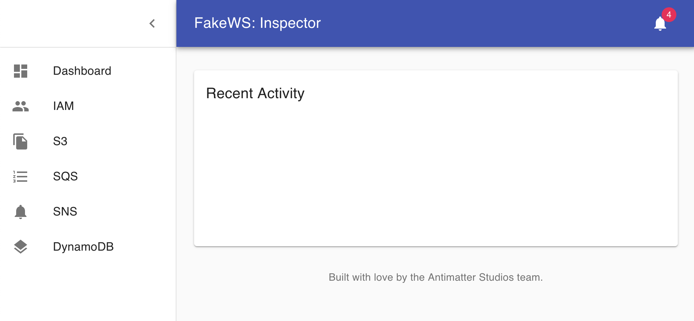

# FakeWS
A Fake Amazon Webservices. 

This project is a collection is mock services which provide similar functionality to AWS except it all runs locally. This is perfect for testing things out either in your integration tests, etc, etc. It has limited usefulness since AWS is already available. But perhaps you don't have a 'test' account to play with. Just a real live environment. Then this project might be of use to you.

It's not guaranteed in any way that the services here are 100% compatible with AWS. Most likely corner cases and probably in mocked services from moto, things might succeed which on the real AWS wouldn't work. This is after all just a mock system and you have to realise there are limitations to it's abilities.

## FakeWS Amazon Console

There is a small user interface letting you inspect various aws components created and maintained. But it's extremely limited and it's mainly for inspecting data and not doing anything fancy.

It's available using the "console" docker service, ```docker-compose up console``` to see it in action. It will launch a console-api container with an express app to proxy requests to the AWS services, sidestepping the CORS problem that some services have (S3 can't list buckets for example).



### Supported Services and Functionality

- IAM: Provided by https://github.com/picadoh/motocker
    - List Users
- S3: Provided by https://github.com/scality/cloudserver
    - List Buckets
- SQS: Provided by https://github.com/softwaremill/elasticmq
    - List Queues
- SNS: Provided by https://github.com/s12v/sns
    - List Topics
    - List Subscriptions
- DynamoDB: Provided by https://hub.docker.com/r/amazon/dynamodb-local/
    - List Tables

### Could be interesting?

I'm just going to drop some links here to keep track of things as I find them.

- https://airbnb.io/airpal/